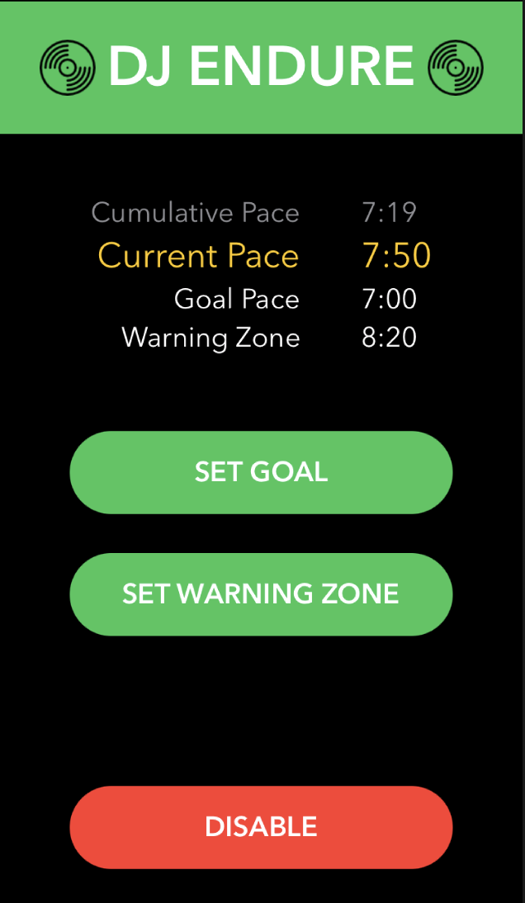

#  DJ ENDURE
### an Iphone app that motivates you to reach your running pace goals with Spotify playback

## about
Maintaining your goal pace while running is difficult. Sometimes you do not even realize if you are slowing down. One motivation to prevent this is the threat of your music stopping. DJ Endure hooks up to your Spotify app and pauses your music if you are below your goal pace for too long. Set the threshold for your goal pace, as well as a warning threshold that will trigger a phone vibrate to warn you that you are at risk of falling behind. DJ Endure opens up Spotify and starts or continues your music every time you open the app. Just disable the app when you don't want your music controlled anymore.

## tools used
- SwiftUI
- Spotify ios-sdk
- CoreLocation

## run locally
Be sure to select the City Run location simulation when running the simulator or UI Tests

## todo
- Apple Watch app

## resources
https://www.raywenderlich.com/553-how-to-make-an-app-like-runkeeper-part-1 
https://medium.com/how-to-track-users-location-with-high-accuracy-ios/make-it-even-better-than-nike-how-to-filter-locations-tracking-highly-accurate-location-in-774be045f8d6
https://gist.github.com/olame/140b3cb0d120494671ddb9dc1c2e6b0f

Icons made by <a href="https://www.flaticon.com/free-icon/vinyl_287473?term=music%20record&page=6&position=77" title="Nikita Golubev">Nikita Golubev</a> from <a href="https://www.flaticon.com/" title="Flaticon">www.flaticon.com</a>

